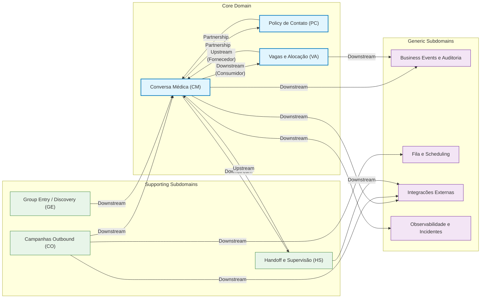

# Relatório de Arquitetura e Recomendações DDD - Projeto Julia

**Status:** Proposta Inicial (v1.0)
**Data:** 2026-02-21
**Autores:** Manus AI, Rafael

## 1. Visão Geral e Objetivo

Este documento apresenta uma análise da arquitetura atual do projeto Julia sob a ótica do **Domain-Driven Design (DDD)**. Ele se baseia nos documentos de diagnóstico existentes (ADRs, relatórios) e em uma análise estática da base de código.

O objetivo é fornecer um **diagnóstico visual e acionável** dos pontos fortes e das áreas de melhoria, além de um **plano de refatoração pragmático** para fortalecer as fronteiras dos contextos de domínio, reduzir o acoplamento e aumentar a manutenibilidade e a escalabilidade do sistema.

## 2. Mapa de Contextos (Context Map) Enriquecido

O diagrama a seguir expande o mapa de contextos original, anotando os padrões de relacionamento entre os Bounded Contexts para tornar as dependências e a dinâmica de poder mais explícitas.

**Legenda dos Padrões:**
*   **Upstream/Downstream:** Relação cliente-fornecedor. O contexto *Downstream* (ex: `ConversaMedica`) é impactado por mudanças no *Upstream* (ex: `VagasAlocacao`), mas o contrário não é verdadeiro. O Upstream define o contrato.
*   **Partnership (Parceria):** Dois contextos são mutuamente dependentes e precisam evoluir em sincronia. Uma mudança em `ConversaMedica` provavelmente exige uma mudança em `PolicyContato`, e vice-versa.

## 3. Análise dos Bounded Contexts e Dívida Arquitetural

A tabela a seguir detalha os principais contextos, suas responsabilidades e os "maus cheiros" (code smells) arquiteturais identificados, com foco no vazamento da camada de persistência para a camada de interface (rotas da API).

| Bounded Context | Responsabilidade Principal | Artefatos de Código Relevantes | Vazamento de Persistência Identificado (SQL em Rotas) |
| :--- | :--- | :--- | :--- |
| **Campanhas Outbound** | Segmentação, execução e enfileiramento de campanhas proativas. | `routes/campanhas.py` `services/campanhas/*` `services/segmentacao.py` | 🔴 **Crítico** (`campanhas.py`: 10+ chamadas diretas) |
| **Group Entry** | Gerenciamento de links de convite para grupos de WhatsApp. | `routes/group_entry.py` | 🔴 **Crítico** (`group_entry.py`: 4+ chamadas diretas) |
| **Handoff/Supervisão** | Transição IA-humano e canais de supervisão. | `routes/supervisor_channel.py` `routes/handoff.py` | 🔴 **Crítico** (`supervisor_channel.py`: 20+ chamadas diretas) |
| **Policy de Contato** | Decidir se, quando e como um médico pode ser contatado. | `routes/policy.py` `services/policy/*` | 🟡 **Moderado** (`policy.py`: 1 chamada direta) |
| **Vagas e Alocação** | Disponibilidade, reserva e conflitos de plantões. | `services/vagas/*` | 🟢 **Baixo** (Acesso a dados já encapsulado nos serviços/repositórios) |
| **Chips (Multi-chip)** | Gerenciamento de números de telefone (instâncias de WhatsApp). | `routes/webhook_router.py` `routes/webhook_zapi.py` | 🔴 **Crítico** (Múltiplas chamadas em todas as rotas de webhooks) |

## 4. Mapa de Calor da Dívida Arquitetural

Este mapa de calor visualiza a urgência de refatoração. A intensidade da cor representa a quantidade de chamadas diretas a `supabase.table()` dentro dos arquivos de rotas da API, o que viola diretamente o **ADR-007**.

| Arquivo da Rota (`app/api/routes/`) | Nível de Dívida (Chamadas Diretas) | Prioridade de Refatoração |
| :--- | :--- | :--- |
| `supervisor_channel.py` | **MUITO ALTO** (>20) | **1ª** |
| `campanhas.py` | **ALTO** (>10) | **2ª** |
| `webhook_router.py` | **ALTO** (>10) | **3ª** |
| `webhook_zapi.py` | **ALTO** (>10) | **3ª** |
| `group_entry.py` | **MÉDIO** (>4) | **4ª** |
| `policy.py` | **BAIXO** (1) | **5ª** |

## 5. Recomendações e Plano de Ação

Com base no diagnóstico, o plano de ação visa pagar a dívida arquitetural de forma incremental, começando pelos pontos de maior impacto.

**Fase 1: Fundações e Prova de Conceito (Este PR)**
1.  **Estabelecer a Linguagem Ubíqua:** Oficializar o `domain_glossary.md`.
2.  **Implementar a Arquitetura em Camadas (PoC):** Refatorar o contexto de **Campanhas** como prova de conceito, introduzindo a estrutura `Application Service -> Repository` para isolar o domínio da interface e da persistência.
3.  **Criar o Pull Request:** Entregar a documentação (este relatório, glossário) e o código da PoC para revisão e merge.

**Fase 2: Refatoração Incremental (Próximas Sprints)**
1.  **Aplicar o Padrão:** Usar a PoC de `Campanhas` como modelo para refatorar os outros contextos críticos, seguindo a ordem de prioridade do Mapa de Calor (começando por `supervisor_channel.py`).
2.  **Fortalecer a Governança:** Adicionar um check no processo de Code Review para impedir novos acessos diretos ao Supabase em arquivos de rotas, conforme o **ADR-007**.

**Fase 3: Consolidação do Domínio**
1.  **Modelar Agregados:** Após isolar a persistência, modelar Agregados explícitos (ex: `Medico`, `Campanha`) para garantir a consistência transacional das regras de negócio.
2.  **Criar Camadas Anti-Corrupção (ACL):** Implementar ACLs formais para as integrações externas (WhatsApp, Slack), protegendo o domínio de mudanças em APIs de terceiros.

Ao seguir este plano, o Projeto Julia estará bem posicionado para escalar com mais segurança, clareza e agilidade, garantindo que a complexidade do negócio seja gerenciada de forma sustentável dentro do código.
