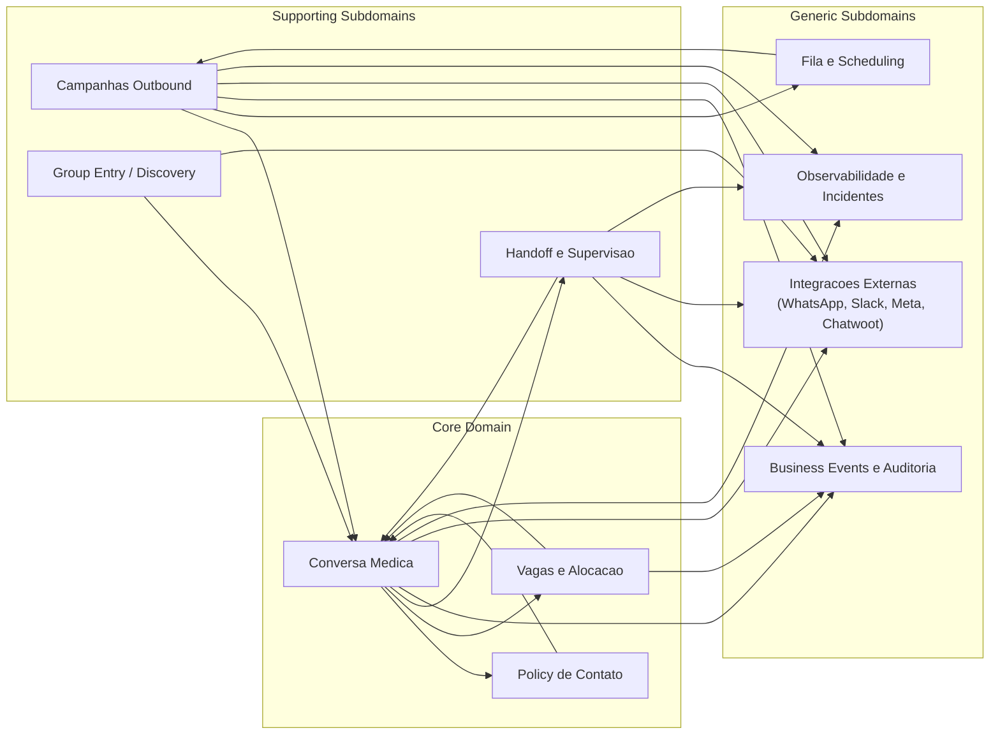

# DDD Context Map - Agente Julia

**Data:** 2026-02-21  
**Status:** Draft operacional (as-is)  
**Base:** Evans DDD + diagnostico interno

## 1. Diagrama de Contextos

## 2. Legenda de Relacoes

- `A -> B`: A consome capacidades/contratos de B
- Conexoes bidirecionais: cooperacao com troca de estado/efeitos
- Contextos `Generic` nao sao core de dominio, mas suportam os fluxos core

## 3. Bounded Contexts e Contratos

## 3.1 Conversa Medica

- **Responsabilidade:** ciclo conversacional com medico (inbound, contexto, resposta, controle IA/humano)
- **Entradas:** webhooks WhatsApp, eventos de campanha, eventos de handoff
- **Saidas:** mensagens outbound, interacoes, eventos de negocio
- **Modulos principais:** `app/pipeline/*`, `app/services/agente/*`, `app/services/conversa.py`, `app/services/medico.py`

## 3.2 Policy de Contato

- **Responsabilidade:** decidir acao permitida, tom e necessidade de handoff
- **Entradas:** estado do medico + contexto da conversa
- **Saidas:** decisao deterministica (`PolicyDecision`) e efeitos auditaveis
- **Modulos principais:** `app/services/policy/*`

## 3.3 Vagas e Alocacao

- **Responsabilidade:** disponibilidade, compatibilidade, reserva, cancelamento e conclusao
- **Entradas:** intencao do medico, regras de conflito, estado da vaga
- **Saidas:** oferta de vagas, reservas, eventos de alocacao
- **Modulos principais:** `app/services/vagas/*`, `app/services/confirmacao_plantao.py`

## 3.4 Campanhas Outbound

- **Responsabilidade:** segmentacao, execucao de campanha e enfileiramento
- **Entradas:** audiencia, regras anti-spam, templates/objetivo
- **Saidas:** mensagens enfileiradas, metricas e attribution
- **Modulos principais:** `app/services/campanhas/*`, `app/services/segmentacao.py`

## 3.5 Handoff e Supervisao

- **Responsabilidade:** transicao IA-humano e handoff externo de confirmacao
- **Entradas:** triggers de risco/solicitacao humana
- **Saidas:** controle humano, notificacoes e eventos de handoff
- **Modulos principais:** `app/services/handoff/*`, `app/services/external_handoff/*`

## 3.6 Business Events e Auditoria

- **Responsabilidade:** trilha de eventos para analytics, compliance e automacao
- **Entradas:** eventos emitidos pelos contextos core/supporting
- **Saidas:** consultas de funil, metricas, reconciliacao
- **Modulos principais:** `app/services/business_events/*`

## 3.7 Contextos Genericos (Infra)

- **Fila/Scheduling:** `app/services/fila.py`, `app/workers/scheduler.py`
- **Integracoes Externas:** `app/services/whatsapp_providers/*`, `app/services/slack/*`, `app/services/meta/*`, `app/services/chatwoot.py`
- **Observabilidade:** `app/api/routes/incidents.py`, `app/core/metrics.py`, `app/core/logging.py`

## 4. Regras de Fronteira (Governanca)

1. Rotas API de dominio nao devem acessar banco diretamente.
2. Fluxos de dominio devem passar por Application Service por contexto.
3. Mudancas de estado canonico devem ser registradas no contrato do contexto.
4. Integracao externa deve entrar por ACL/adapters do contexto dono.

## 5. Pontos de Evolucao (proximas sprints)

1. Consolidar ownership por contexto.
2. Migrar rotas criticas para boundary `API -> Application -> Repository`.
3. Padronizar estados canonicos e aliases legados.
4. Publicar checklist de PR arquitetural baseado neste context map.

