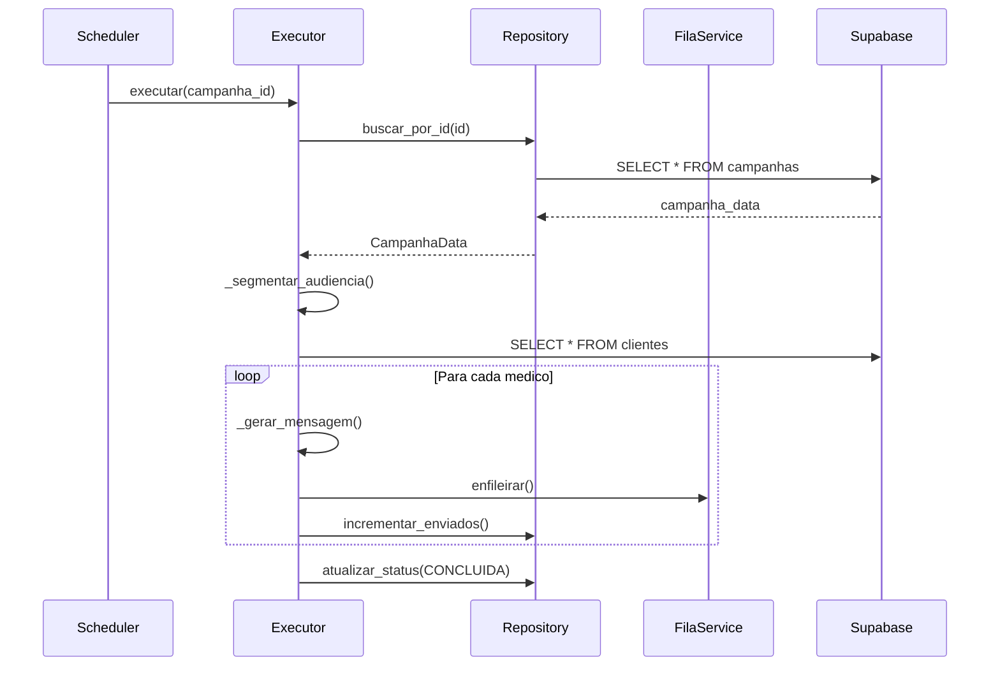

# Epic 09: Documentacao

## Objetivo

Atualizar documentacao de arquitetura para refletir as mudancas feitas nesta sprint.

## Contexto

Apos a refatoracao dos modulos de campanha, a documentacao precisa ser atualizada para que futuros desenvolvedores entendam a nova arquitetura.

---

## Story 9.1: Atualizar Docs de Arquitetura

### Objetivo

Atualizar `docs/arquitetura/` com informacoes sobre o novo modulo de campanhas.

### Tarefas

1. **Criar/atualizar** `docs/arquitetura/campanhas.md`:

```markdown
# Arquitetura de Campanhas

## Visao Geral

O sistema de campanhas permite enviar mensagens em massa para medicos segmentados.

## Tipos de Campanha

| Tipo | Descricao | Geracao de Mensagem |
|------|-----------|---------------------|
| `discovery` | Primeiro contato | Dinamica via `obter_abertura_texto()` |
| `oferta` | Oferta de vaga especifica | Template no campo `corpo` |
| `reativacao` | Reativar medico inativo | Template no campo `corpo` |
| `followup` | Seguimento de conversa | Template no campo `corpo` |

## Estrutura de Modulos

```
app/services/campanhas/
├── __init__.py          # Exports publicos
├── types.py             # Enums e dataclasses
├── repository.py        # CRUD de campanhas
└── executor.py          # Execucao de campanhas
```

## Fluxo de Execucao



## Tabelas Relacionadas

### campanhas

| Coluna | Tipo | Descricao |
|--------|------|-----------|
| `id` | SERIAL | PK |
| `nome_template` | TEXT | Nome identificador |
| `tipo_campanha` | TEXT | discovery, oferta, reativacao, followup |
| `status` | TEXT | rascunho, agendada, ativa, pausada, concluida, cancelada |
| `corpo` | TEXT | Template da mensagem (opcional para discovery) |
| `tom` | TEXT | Tom da mensagem (amigavel, profissional, etc) |
| `audience_filters` | JSONB | Filtros de segmentacao |
| `agendar_para` | TIMESTAMPTZ | Data/hora de execucao |
| `total_destinatarios` | INT | Quantidade de destinatarios |
| `enviados` | INT | Quantidade ja enviada |

### fila_mensagens

Mensagens sao enfileiradas aqui com `metadata.campanha_id`.

### Views

- `campaign_sends` - Envios por campanha
- `campaign_metrics` - Metricas agregadas

## Uso

### Criar Campanha

```python
from app.services.campanhas import campanha_repository
from app.services.campanhas.types import TipoCampanha, AudienceFilters

campanha = await campanha_repository.criar(
    nome_template="Discovery Cardiologistas SP",
    tipo_campanha=TipoCampanha.DISCOVERY,
    audience_filters=AudienceFilters(
        especialidades=["cardiologia"],
        regioes=["SP"],
        quantidade_alvo=100,
    ),
)
```

### Executar Campanha

```python
from app.services.campanhas import campanha_executor

sucesso = await campanha_executor.executar(campanha_id=16)
```

## Decisoes de Design

1. **Geracao dinamica para discovery**: Campanhas discovery usam `obter_abertura_texto()` para gerar mensagens unicas, evitando deteccao como spam.

2. **Fila de mensagens**: Todas as mensagens vao para `fila_mensagens` para rate limiting e retry.

3. **Separacao repository/executor**: Repository para CRUD, Executor para logica de negocio.
```

### DoD

- [ ] Arquivo `docs/arquitetura/campanhas.md` criado/atualizado
- [ ] Diagrama de fluxo incluido
- [ ] Tabelas documentadas
- [ ] Exemplos de uso incluidos

---

## Story 9.2: Atualizar CLAUDE.md

### Objetivo

Atualizar referencias no CLAUDE.md para refletir nova estrutura.

### Tarefas

1. **Verificar referencias** a modulos de campanha:

```bash
grep -n "campanha" CLAUDE.md
```

2. **Atualizar secao de servicos** (se existir):

```markdown
## Servicos Principais

### Campanhas
- `app/services/campanhas/` - Modulo de campanhas (repository, executor, types)
- **NAO usar** `app/services/campanha.py` - DEPRECATED
```

3. **Adicionar na secao de convencoes** (se relevante):

```markdown
### Import de Campanhas

```python
# Correto
from app.services.campanhas import campanha_repository, campanha_executor
from app.services.campanhas.types import TipoCampanha, StatusCampanha

# Incorreto (deprecated)
from app.services.campanha import criar_envios_campanha
```
```

### DoD

- [ ] CLAUDE.md revisado
- [ ] Referencias a modulos deprecated removidas
- [ ] Novos modulos documentados

---

## Story 9.3: Documentar Decisoes Tecnicas

### Objetivo

Garantir que as decisoes tecnicas desta sprint estejam documentadas.

### Tarefas

1. **Verificar arquivo** `planning/sprint-35-debt-cleanup/decisoes-tecnicas.md`:
   - Ja criado nas tasks anteriores
   - Verificar se esta completo

2. **Mover para docs/** (se apropriado):

```bash
# Se decisoes forem permanentes, copiar para docs
cp planning/sprint-35-debt-cleanup/decisoes-tecnicas.md docs/arquitetura/decisoes/sprint-35-campanhas.md
```

3. **Atualizar indice de decisoes** (se existir `docs/arquitetura/decisoes/README.md`):

```markdown
## Decisoes de Arquitetura

| Data | Decisao | Documento |
|------|---------|-----------|
| 2026-01 | Refatoracao campanhas | `sprint-35-campanhas.md` |
```

### DoD

- [ ] Decisoes tecnicas documentadas permanentemente
- [ ] Indice de decisoes atualizado (se existir)

---

## Story 9.4: Atualizar Docstrings

### Objetivo

Garantir que todos os modulos novos tenham docstrings adequadas.

### Tarefas

1. **Verificar docstrings** nos arquivos criados:

```bash
# Verificar se tem docstrings
head -20 app/services/campanhas/__init__.py
head -20 app/services/campanhas/types.py
head -20 app/services/campanhas/repository.py
head -20 app/services/campanhas/executor.py
```

2. **Padrao de docstring** (Google style):

```python
"""Modulo de [descricao].

Este modulo fornece [funcionalidade].

Example:
    ```python
    from app.services.campanhas import campanha_repository

    campanha = await campanha_repository.criar(...)
    ```

Attributes:
    campanha_repository: Instancia singleton do repository.
"""
```

3. **Verificar funcoes publicas**:

```python
async def criar(
    nome_template: str,
    tipo_campanha: TipoCampanha,
    **kwargs
) -> Optional[CampanhaData]:
    """Cria nova campanha.

    Args:
        nome_template: Nome identificador da campanha.
        tipo_campanha: Tipo da campanha (discovery, oferta, etc).
        **kwargs: Campos opcionais (corpo, tom, audience_filters, etc).

    Returns:
        CampanhaData se criada com sucesso, None caso contrario.

    Raises:
        ValidationError: Se dados invalidos.
        DatabaseError: Se erro no banco.

    Example:
        ```python
        campanha = await campanha_repository.criar(
            nome_template="Discovery SP",
            tipo_campanha=TipoCampanha.DISCOVERY,
        )
        ```
    """
```

### DoD

- [ ] Todos os modulos tem docstring de modulo
- [ ] Funcoes publicas tem docstrings completas
- [ ] Exemplos incluidos onde apropriado

---

## Story 9.5: Criar Changelog

### Objetivo

Documentar mudancas da sprint para referencia futura.

### Tarefas

1. **Criar/atualizar** `docs/CHANGELOG.md` ou `planning/sprint-35-debt-cleanup/CHANGELOG.md`:

```markdown
# Changelog - Sprint 35: Debt Cleanup

## [1.x.x] - 2026-01-XX

### Added
- Novo modulo `app/services/campanhas/` com repository e executor
- Types dedicados para campanhas (TipoCampanha, StatusCampanha, etc)
- Testes unitarios para modulo de campanhas

### Changed
- Endpoints de campanhas agora usam novos modulos
- Geracao de mensagem discovery agora usa `obter_abertura_texto()`

### Deprecated
- `app/services/campanha.py` - usar `app/services/campanhas/` em vez

### Removed
- Referencias a tabela `envios_campanha` (removida do banco)
- Coluna `mensagem_template` (nao existe)
- Coluna `tipo` (usar `tipo_campanha`)
- Coluna `config` (usar `audience_filters`)
- Coluna `nome` (usar `nome_template`)

### Fixed
- KeyError 'mensagem_template' ao executar campanha 16
- Endpoint POST /campanhas/ usando colunas erradas
- Endpoint GET /campanhas/{id}/relatorio com KeyError
```

### DoD

- [ ] Changelog criado
- [ ] Todas as mudancas documentadas
- [ ] Formato padrao (Keep a Changelog)

---

## Story 9.6: Revisar README do Modulo

### Objetivo

Criar README especifico para o modulo de campanhas.

### Tarefas

1. **Criar** `app/services/campanhas/README.md`:

```markdown
# Modulo de Campanhas

## Estrutura

```
campanhas/
├── __init__.py      # Exports: campanha_repository, campanha_executor
├── types.py         # TipoCampanha, StatusCampanha, CampanhaData, AudienceFilters
├── repository.py    # CampanhaRepository - CRUD
├── executor.py      # CampanhaExecutor - Execucao
└── README.md        # Este arquivo
```

## Uso Rapido

```python
# Criar campanha
from app.services.campanhas import campanha_repository
from app.services.campanhas.types import TipoCampanha

campanha = await campanha_repository.criar(
    nome_template="Minha Campanha",
    tipo_campanha=TipoCampanha.DISCOVERY,
)

# Executar
from app.services.campanhas import campanha_executor

await campanha_executor.executar(campanha.id)
```

## Tipos de Campanha

- `discovery` - Primeiro contato (mensagem dinamica)
- `oferta` - Oferta de vaga (usa `corpo`)
- `reativacao` - Reativar inativo (usa `corpo`)
- `followup` - Seguimento (usa `corpo`)

## Testes

```bash
uv run pytest tests/services/campanhas/ -v
```
```

### DoD

- [ ] README do modulo criado
- [ ] Exemplos de uso incluidos
- [ ] Comando de teste documentado

---

## Checklist do Epico

- [ ] **S35.E09.1** - Docs de arquitetura atualizados
- [ ] **S35.E09.2** - CLAUDE.md atualizado
- [ ] **S35.E09.3** - Decisoes tecnicas documentadas
- [ ] **S35.E09.4** - Docstrings completas
- [ ] **S35.E09.5** - Changelog criado
- [ ] **S35.E09.6** - README do modulo criado

### Comandos de Verificacao

```bash
# Verificar que docs existem
ls docs/arquitetura/campanhas.md
ls app/services/campanhas/README.md

# Verificar docstrings (manual)
uv run python -c "from app.services.campanhas import campanha_repository; help(campanha_repository.criar)"
```

---

## Tempo Estimado

| Story | Tempo |
|-------|-------|
| 9.1 Docs arquitetura | 45min |
| 9.2 CLAUDE.md | 15min |
| 9.3 Decisoes tecnicas | 15min |
| 9.4 Docstrings | 30min |
| 9.5 Changelog | 15min |
| 9.6 README modulo | 15min |
| **Total** | **2h15min** |

---

## Notas

- Documentacao e tao importante quanto codigo
- Novos desenvolvedores devem conseguir entender o modulo apenas lendo a documentacao
- Manter documentacao atualizada conforme o codigo evolui
